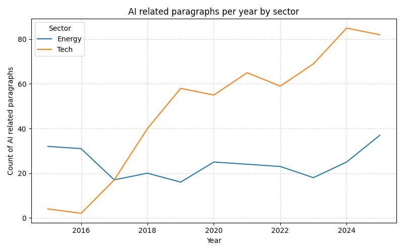

# Team Rameez Rameez and Rameez

## Team members
Rameez Rauf

## Data Source

What data source did you work with?
The project uses the SEC EDGAR data hosted on data.sec.gov. Company metadata and filing history come from the public Submissions API, and full filing text is pulled from the corresponding HTML documents in the SEC Archives. The analysis focuses on large tech and energy firms, filtering for 10-K, 10-Q, 8-K, and 6-K style filings between 2015 and 2025, then extracting paragraphs that mention artificial intelligence related keywords.

## Challenges / Obstacles

What challenges did this data choice present in data gathering, processing and analysis, and how did you work through them? What methods and tools did you use to work with this data?

Working with EDGAR involved several challenges. The HTML structure of filings is inconsistent across companies and years, so a custom parser was needed using BeautifulSoup plus text cleaning and paragraph splitting logic. The SEC APIs have informal rate limits, so the pipeline was designed around polite server usage. Some tickers lack older data or return 404s for certain CIKs, so defensive error handling and logging were added to skip bad records without stopping the run. Finally, the extracted paragraphs were stored in DuckDB for fast aggregation and re-use, with Prefect orchestrating a repeatable three stage flow: fetch filings, parse AI paragraphs, then run analysis and plotting with pandas and matplotlib. The data was processed in batches to manage memory and speed with the help of ChatGPT for code suggestions. The original code took over an hour to work through all filings, but optimizations brought it down to around 20 minutes.

## Analysis

Offer a brief analysis of the data with your findings. Keep it to one brief, clear, and meaningful paragraph.

The data reveals a split trend between sectors. Tech companies consistently mention AI more frequently in their filings, dominating 10-K and 10-Q reports with high counts of AI-related terms and surrounding language. However, starting in 2021, the Energy sector shows a notable shift: although Energy firms reference AI less often, their AI-related paragraphs tend to be longer and more detailed, suggesting deeper descriptions of operational use cases. One unexpected finding is that Adobe leads all companies in total AI-related paragraphs, surpassing even the largest tech firms. This highlights how certain software-focused companies emphasize AI more heavily in narrative reporting, even when not traditionally grouped with high-profile AI leaders.

## Plot / Visualization

Another cool plot:

## GitHub Repository
https://github.com/rameezrauf/ds3022-data-project-3
